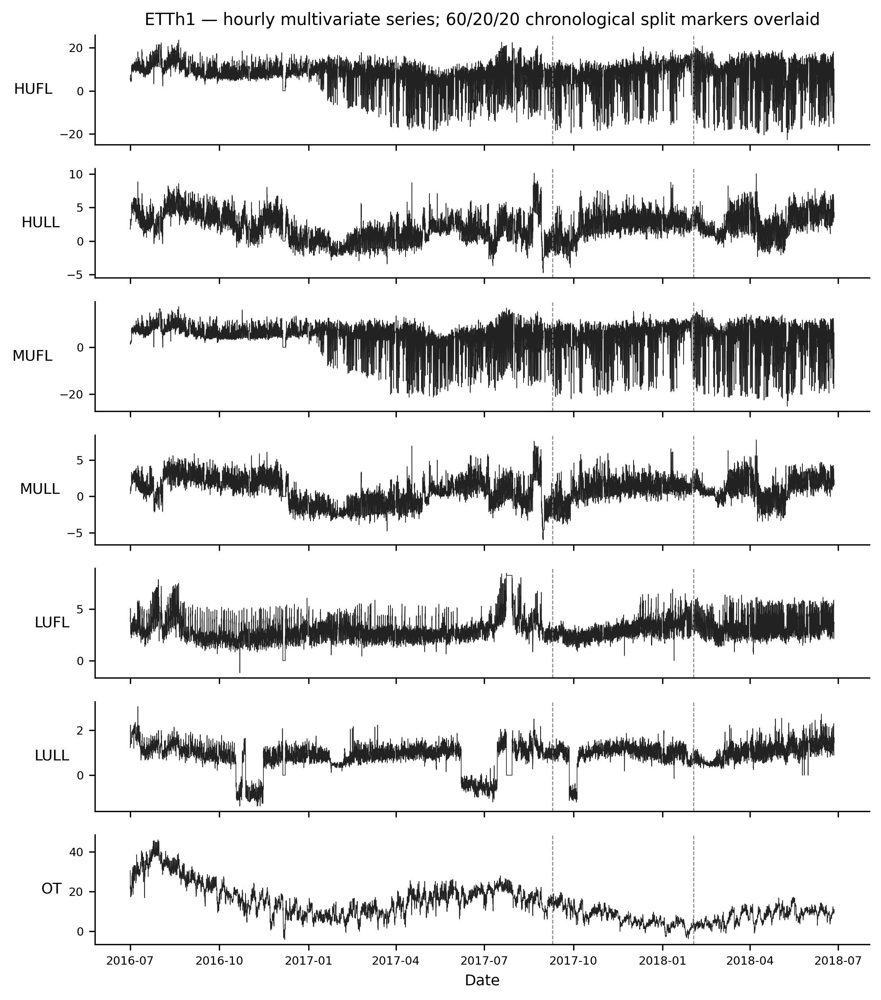
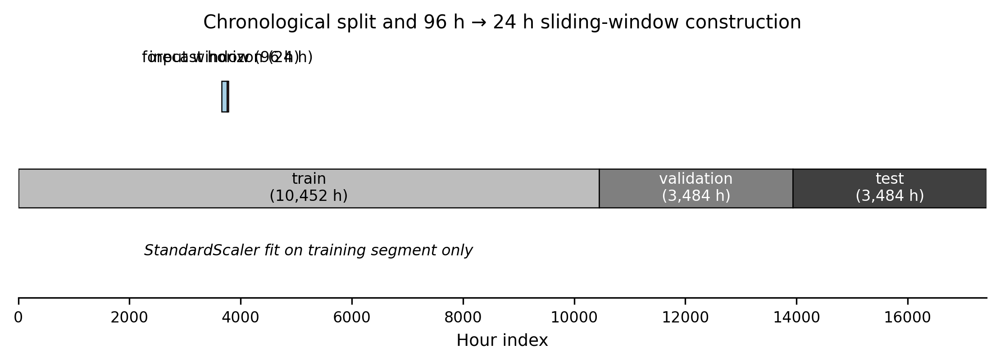
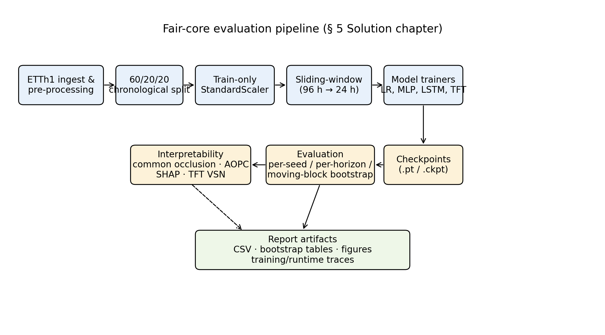
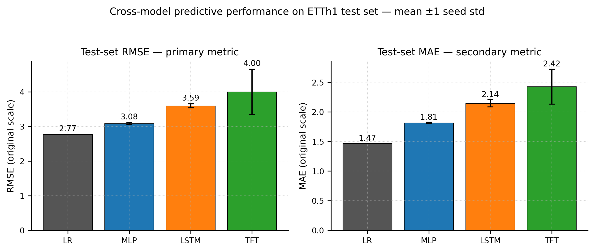
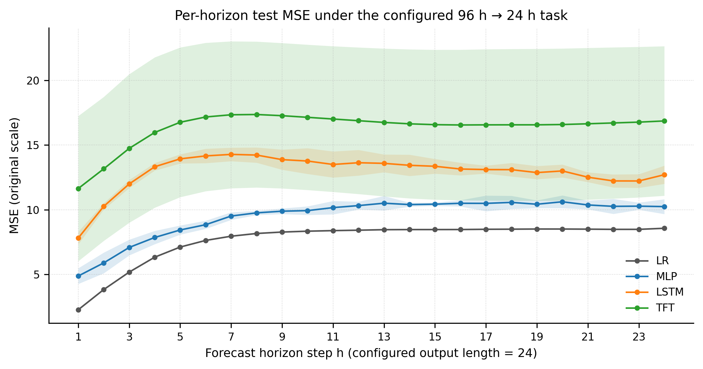
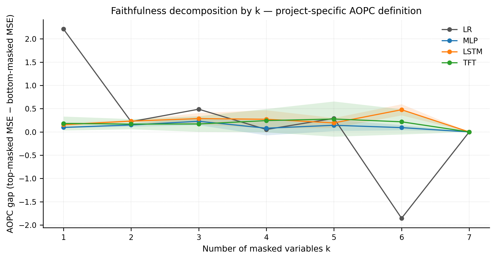
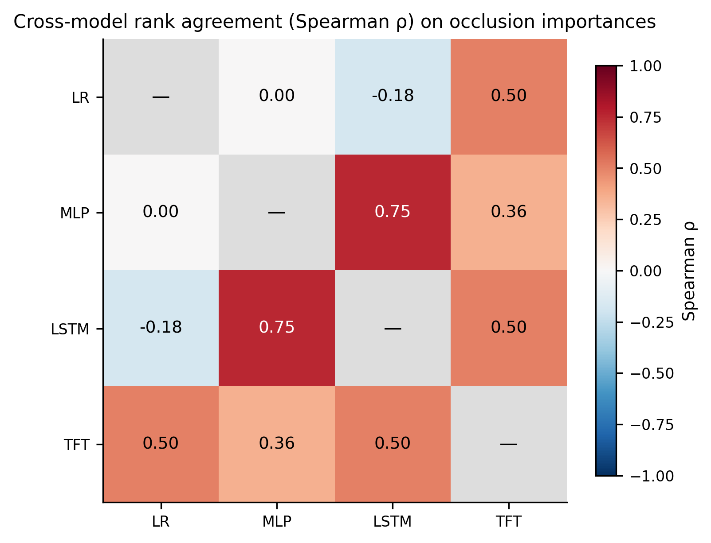
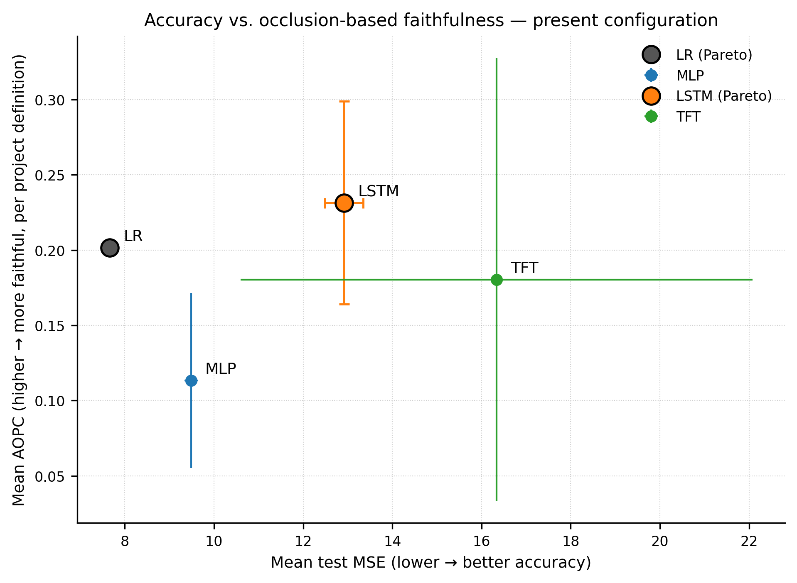
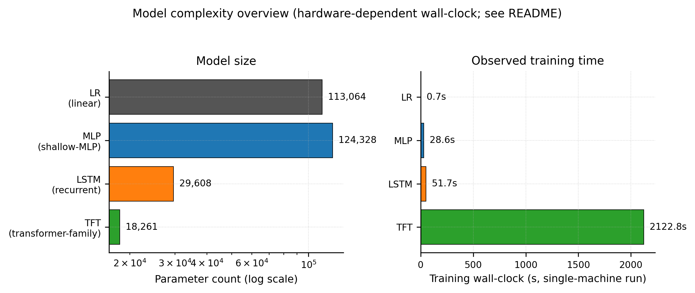

# 3. Solution

## 3.1 Pipeline Overview

The solution developed in this thesis is a reproducibility-supported forecasting evaluation pipeline. Its purpose is to compare the selected forecasting models under one shared experimental contract, not to produce an isolated result table. The pipeline starts with the ETTh1 dataset, removes the timestamp column from the numerical modelling tensor, applies a chronological train/validation/test split, fits the scaler only on the training partition, and creates supervised sliding windows inside each split. These prepared tensors form the common input for LR, MLP, LSTM, and TFT.

After data preparation, the pipeline separates model-specific training from downstream analysis. LR is fitted once as a deterministic baseline. MLP, LSTM, and TFT are trained as stochastic neural models across the active five-seed configuration: 42, 123, 456, 789, and 1024. For these neural models, per-seed checkpoints are part of the artifact. After training or fitting, predictions are exported as fixed arrays. Evaluation, uncertainty analysis, complexity reporting, and explainability analysis then consume those exported artifacts rather than repeatedly rerunning training code.

The pipeline has two downstream analysis branches. The evaluation branch produces final original-scale point metrics, paired moving-block bootstrap intervals, per-horizon descriptive metrics, complexity indicators, training-curve traces, runtime traces, figures, and generated tables. The explainability branch produces the primary occlusion-based importance outputs, AOPC summaries, and cross-model rank agreement. SHAP outputs for LR, MLP, and LSTM and TFT-native VSN / `interpret_output` importance are retained as auxiliary explanation artifacts. The final verification layer checks the active configuration, expected artifacts, checkpoints where applicable, prediction arrays, figures, and checksum manifest coverage.

This organization is important because the research questions depend on several linked outputs. RQ1 needs prediction tensors and original-scale metrics. RQ2 needs a shared explanation instrument and agreement measures. RQ3 needs performance, explainability, and complexity information in the same configuration. The pipeline therefore acts as the connecting artifact between methodology and results. It turns abstract requirements such as "same task" and "same preprocessing" into concrete files, arrays, tables, and figures that can be inspected.

## 3.2 Data Processing Component

The data-processing component is where the comparability contract first becomes concrete. The pipeline loads `data/ETTh1.csv`, whose columns are `date`, HUFL, HULL, MUFL, MULL, LUFL, LULL, and OT. The date column is used as a timestamp column and is removed from the modelling tensor. The remaining seven numerical variables are used both as inputs and as multivariate prediction targets. This choice avoids an OT-only task and keeps all four models aligned on the same multivariate forecasting problem.

*Figure 1: Hourly multivariate ETTh1 over the 17,420-hour record with 60/20/20 split markers.*

Figure 1 shows the full ETTh1 record across the seven numerical variables. The figure is useful because it makes two properties visible before modelling begins: the variables do not share the same scale, and the time series changes over the chronological record. These two properties motivate train-only standardization and a chronological split. The split markers in the figure also show that the thesis evaluates later time segments as validation and test data rather than shuffling rows randomly.

The pipeline then performs a chronological 60/20/20 split. The `StandardScaler` is fitted only on the training partition and then applied to the validation and test partitions. This avoids using future validation or test distributional information in the scaling parameters. Sliding windows are created separately inside each split with a 96-hour input window and a 24-hour forecast horizon. Because windows are created after splitting, no supervised window crosses from training into validation or from validation into test.

*Figure 2: Chronological split with a representative 96-hour input + 24-hour forecast window.*

Figure 2 illustrates the split-then-window regime. The figure is not a result plot; it documents the experimental task. It shows that each forecast uses a fixed past context and predicts a fixed future horizon. This matters for fairness because every model receives the same amount of past information and is evaluated on the same direct multi-step forecasting task.

The output of the data-processing component is not a single table but a set of aligned tensors. The unflattened windows are needed by sequence models such as LSTM and TFT, while flattened versions are needed by LR and MLP. Both forms represent the same information: 96 time steps, seven variables, and a 24-step multivariate target. This shared representation is the reason the later model comparison can focus on model behaviour rather than on different input definitions.

## 3.3 Model Implementation Summary

The model layer implements four structurally different forecasting approaches while preserving the shared task. LR is the deterministic baseline. It receives the flattened 96 x 7 input window and predicts the flattened 24 x 7 output window once through a fitted linear model. Because LR is deterministic in this setup, it has no seed axis, no epoch-based early stopping, and no checkpoint.

MLP is implemented as a feed-forward neural model. LSTM is implemented as a recurrent model that compresses temporal information through a hidden state before the output layer. TFT is implemented through the `pytorch-forecasting` and Lightning pathway as a transformer-family forecasting model. MLP, LSTM, and TFT are trained across the active seeds 42, 123, 456, 789, and 1024. For these models, checkpoints are saved per seed and later restored for prediction export and evaluation.

The explanation interfaces differ by model family, but the primary comparison is kept common. LR, MLP, LSTM, and TFT all enter the primary occlusion workflow. SHAP outputs are produced only as auxiliary artifacts for LR, MLP, and LSTM. TFT is not treated as a SHAP model; its architecture-native explanation output comes from VSN / `interpret_output` importance.

*Figure 3: End-to-end fair-core evaluation pipeline (training-curve and runtime traces written to result CSVs).*

Figure 3 visualizes the full artifact structure. It shows that the data-processing layer feeds several model-specific training or fitting paths, and that downstream evaluation and explainability reuse the resulting artifacts. The diagram is important for the thesis argument because it shows why the artifact is a pipeline: performance metrics, uncertainty intervals, explanation outputs, figures, and verification records are generated by connected components rather than by disconnected model runs.

The implementation preserves model-specific differences where they are necessary. LR is not forced into an epoch-based training loop, because that would misrepresent the deterministic baseline. TFT is not rewritten as a plain PyTorch module, because its implementation depends on the `pytorch-forecasting` and Lightning ecosystem. MLP and LSTM use a custom PyTorch training loop because their architecture is simpler and the restore-best behaviour can be controlled directly. The comparison is therefore not "same code for every model", but "same experimental contract around model-specific code".

## 3.4 Evaluation and Artifact Generation

The evaluation component converts model predictions and targets back to the original ETTh1 scale before computing the final reported point metrics. MSE, MAE, and RMSE are computed over aligned prediction tensors. Each scalar metric aggregates across test windows, forecast horizon steps, and the seven target variables. For stochastic models, seed-level metrics are summarized across the five active seeds; LR reports one deterministic value. Diagnostic scaled metrics may still appear in supporting artifacts, especially where scaled inputs are required for explainability, but they are not the headline performance metrics.

Prediction export is the handoff between model training and downstream analysis. The active result directory contains `preds_lr.npy` for LR and per-seed prediction arrays for MLP, LSTM, and TFT. This frozen-prediction design matters because bootstrap intervals, point metric summaries, and several downstream checks can operate on fixed artifacts. It reduces the risk that later tables are silently generated from a different model state.

The generated CSV artifacts include per-seed metrics, per-horizon metrics, bootstrap intervals, runtime traces, training-curve traces, complexity indicators, occlusion importance, AOPC summaries, cross-model rank agreement, and trade-off data. The verification report in `results/bachelor_safe_v2/reproducibility_verification_report.json` records core mode with status PASS for the primary pipeline. It also records the active config, result directory, checkpoint directory, active seeds, checksum manifest status, and 74 verified artifacts. This is an artifact-level verification statement; it does not claim machine-independent numerical execution.

This artifact design also makes the result chapter easier to check. The same active directory contains the CSVs used for tables, the arrays used for downstream evaluation, the prediction files used for bootstrap input, and the figure files used for the thesis. For neural models, the checkpoint files provide the traceable model state behind exported predictions. For LR, traceability comes from the deterministic fitting procedure and the exported prediction array. This distinction keeps the LR exception explicit without weakening the shared evaluation path.

## 3.5 Predictive Performance Results

Within this experimental setup, the evaluated models show model-dependent differences across the final original-scale metrics. Tabelle 1 summarizes the overall MSE, MAE, and RMSE values. Lower values indicate lower forecasting error. The table reports a single fitted value for LR and mean ± standard deviation across stochastic seeds for MLP, LSTM, and TFT.

**Tabelle 1: Overall point metrics on ETTh1 in original scale, reported as mean and standard deviation across stochastic seeds where applicable; LR is deterministic and reports a single fitted value.**

Source: `results/bachelor_safe_v2/per_seed_metrics.csv`.

| Model | MSE | MAE | RMSE |
|---|---:|---:|---:|
| LR | 7.66 | 1.47 | 2.77 |
| MLP | 9.49 ± 0.15 | 1.81 ± 0.01 | 3.08 ± 0.02 |
| LSTM | 12.92 ± 0.43 | 2.14 ± 0.06 | 3.59 ± 0.06 |
| TFT | 16.34 ± 5.74 | 2.42 ± 0.29 | 4.00 ± 0.65 |

Tabelle 1 shows that the deterministic LR baseline has the lowest overall error values in the active ETTh1 configuration. MLP has the next lowest values, followed by LSTM and TFT. This ordering is descriptive for the selected dataset, split, horizon, and metrics. It should not be read as a general statement that simple models are better in general or that neural models cannot be useful in other forecasting settings.

The table also shows why seed handling must be visible in the thesis. MLP and LSTM have relatively small standard deviations in this run, while TFT has a larger seed-level spread in all three final metrics. This does not automatically make TFT unreliable in general, but it matters for the evaluated configuration because the same model family can produce noticeably different outcomes under different stochastic seeds. LR does not have this axis because it is fitted once as a deterministic baseline.

*Figure 4: Mean test-set RMSE and MAE per model. Error bars indicate ±1 standard deviation across stochastic seeds where applicable; LR is deterministic and therefore has no seed-based variation.*

Figure 4 presents the same performance pattern visually for RMSE and MAE. The error bars represent seed-to-seed variation for the stochastic models, not confidence intervals. LR has no error bar because it is deterministic. The figure helps separate two ideas that are easy to mix: the mean error level and the dispersion across stochastic seeds.

The uncertainty layer uses paired moving-block bootstrap intervals over aligned test-window errors. Tabelle 2 reports MSE differences for all six model pairs. A negative value means that the first model has lower MSE than the second model under the exported prediction artifacts.

**Tabelle 2: Paired moving-block bootstrap 95 % confidence intervals on per-window MSE differences (block length L = 96, N = 10,000 resamples, BOOTSTRAP_SEED = 2026).**

Source: `results/bachelor_safe_v2/bootstrap_intervals.csv`.

| Pair (A vs B) | Mean MSE diff (A - B) | 95 % CI |
|---|---:|---:|
| LR vs MLP | -1.30 | [-1.63, -0.89] |
| LR vs LSTM | -4.41 | [-5.32, -3.41] |
| LR vs TFT | -5.79 | [-6.74, -4.61] |
| MLP vs LSTM | -3.11 | [-4.18, -2.05] |
| MLP vs TFT | -4.49 | [-5.57, -3.29] |
| LSTM vs TFT | -1.38 | [-1.73, -0.89] |

All six intervals are below zero in the reported pair direction. This supports the observed ordering under the active evaluation contract. The intervals should still be interpreted as comparative uncertainty evidence under overlapping time-series windows, not as strict independent-sample inference.

*Figure 5: Per-horizon mean error per model, shown descriptively for the configured 24-step forecast horizon.*

Figure 5 makes the horizon axis visible. It plots test-set error across forecast steps 1 to 24, averaged across seeds for stochastic models and shown once for LR. The figure is descriptive only. It helps the reader see whether error patterns change across the forecast horizon, but the thesis does not introduce separate per-horizon significance tests or per-horizon model claims from this plot.

The predictive-performance layer therefore has three levels. Tabelle 1 gives the overall point metrics, Figure 4 makes RMSE and MAE visually comparable, and Tabelle 2 adds paired uncertainty intervals for MSE differences. Figure 5 then opens the horizon dimension without changing the main aggregation rule. This separation prevents the chapter from mixing headline comparison, uncertainty evidence, and descriptive diagnostics into one overloaded statement.

## 3.6 Interpretability Results

The primary interpretability comparison uses occlusion importance, AOPC, and rank agreement. The occlusion procedure perturbs one input variable at a time in the scaled input space and measures the change in model error. This gives a common post-hoc measurement object for all four selected models. It is a model-behaviour test under one perturbation rule, not a statement about physical variable relevance in the ETTh1 system.

*Figure 6: AOPC contribution per k in {1, ..., 7} per model.*

Figure 6 decomposes the AOPC calculation by the number of occluded variables k. This is important because the AOPC mean can hide whether a model's separation is driven by one highly ranked variable or by a broader ranking pattern. The figure supports the methodological caution that AOPC is criterion-bound: it evaluates faithfulness under the adopted occlusion rule and k range, not explanation quality in general.

The aggregated trade-off data report the following AOPC means: LR 0.202, MLP 0.113, LSTM 0.231, and TFT 0.180. LSTM has the highest AOPC mean, while LR has the lowest forecasting error in Tabelle 1. This means that the performance and AOPC axes do not produce the same ordering.

The AOPC values must be read together with Figure 6. A model can have a high mean AOPC because one or a few ranked variables produce a large error gap when occluded. Another model may show a flatter pattern across k. For this reason, the thesis treats AOPC as a controlled faithfulness criterion, not as a complete measure of interpretability. The plotted per-k behaviour is part of the evidence because it shows how the aggregate is formed.

*Figure 7: Pairwise Spearman rho on seed-averaged occlusion-importance vectors (rank agreement; not evidence about physical variable relevance).*

Figure 7 reports pairwise Spearman rank agreement over seed-averaged occlusion-importance vectors. The Spearman correlations are LR-MLP 0.000, LR-LSTM -0.179, LR-TFT 0.500, MLP-LSTM 0.750, MLP-TFT 0.357, and LSTM-TFT 0.500. The highest agreement is between MLP and LSTM. These values are primary RQ2 evidence because every model is measured through the same occlusion instrument. They are not a formal statistical stability proof.

*Figure 8: Performance-interpretability scatter for overall MSE and occlusion-based AOPC; AOPC error bars are across stochastic seeds where applicable.*

Figure 8 places each model on the two axes used for RQ3: overall MSE and AOPC. The plotted values are LR (MSE 7.66, AOPC 0.202), MLP (9.49, 0.113), LSTM (12.92, 0.231), and TFT (16.34, 0.180). No universal performance-interpretability rule follows from this plot. Within this configuration, the figure shows that LR and LSTM form the clearest comparison: LR has the lowest error, while LSTM has the highest AOPC under the selected occlusion criterion.

SHAP and VSN outputs remain outside the primary comparison. SHAP is used as auxiliary output for LR, MLP, and LSTM. TFT uses VSN / `interpret_output` importance as an architecture-native explanation. These outputs can support a construct-validity discussion, but they are not treated as method-identical to each other or to the primary occlusion workflow.

The distinction between primary and auxiliary explainability outputs is central for thesis safety. Occlusion importance is the common instrument because every model can be perturbed in the same prepared input space. SHAP and VSN do not share that property: SHAP is a post-hoc attribution method applied to fixed prediction functions, while VSN / `interpret_output` comes from the TFT architecture. The Solution chapter therefore reports SHAP/VSN as available artifacts but does not use them as the primary cross-model evidence.

## 3.7 Complexity and Reproducibility Results

Operational complexity is reported through three indicators: parameter count, runtime trace, and model class. The thesis does not reduce complexity to one number because the three indicators can lead to different orderings. Parameter count reflects the number of trainable or fitted parameters. Runtime trace reflects the observed wall-clock time in the local thesis setup. Model class describes the architectural family.

**Tabelle 3: Operational complexity indicators for the selected core models (parameter count, total wall-clock training time on a single NVIDIA RTX 5080 Laptop GPU at batch size 64 — runtime trace; LR is closed-form and reports a single fitted runtime).**

Source: `results/bachelor_safe_v2/complexity_metrics.csv`.

| Model | Parameter count | Model class | Runtime trace |
|---|---:|---|---:|
| LR | 113,064 | linear | 0.67 s |
| MLP | 124,328 | shallow-MLP | 28.60 s |
| LSTM | 29,608 | recurrent | 51.65 s |
| TFT | 18,261 | transformer-family | 2122.80 s |

Tabelle 3 shows why complexity must be treated carefully. MLP has the highest parameter count, TFT has the smallest parameter count, and TFT has the highest runtime trace. The architectural ordering and the parameter-count ordering therefore do not match. This matters for the later discussion of RQ1 and RQ3 because "more complex" can mean different things depending on the chosen complexity indicator.

*Figure 9: Operational complexity indicators per model (parameter count, runtime trace, model class).*

Figure 9 visualizes the same complexity information. The logarithmic parameter-count panel and the runtime panel show that a single complexity axis would be misleading. In the evaluated configuration, TFT is not the largest model by parameter count, but it is the most expensive model by runtime trace.

The current saved verification report records `mode: core` and `status: PASS`. It also records the active configuration `configs/experiments/fair_core_v2.yaml`, the result directory `results/bachelor_safe_v2`, the checkpoint directory `checkpoints/bachelor_safe_v2`, five active seeds, checksum manifest creation, and 74 verified artifacts. The report verifies the primary pipeline artifacts, including configuration checks, dataset checks, core CSVs, primary XAI CSVs, prediction arrays, checkpoints where applicable, figures, generated tables, and provenance outputs. Auxiliary SHAP regeneration is not part of the saved core report state.

This verification result supports the artifact definition used in the thesis. It shows that the active repository state contains the expected primary outputs for the configured pipeline. It does not replace scientific interpretation, and it does not make the numerical results universally reproducible across all hardware or software environments. Its role is narrower and practical: it checks that the active artifact tree is complete and internally consistent enough to serve as the evidence base for the written thesis.

## 3.8 Self-Contained Summary

Chapter 3 shows the artifact and the results together. The artifact is a controlled evaluation pipeline: it loads ETTh1, applies chronological splitting, fits the scaler only on training data, creates split-local windows, trains or fits the selected models, exports predictions, computes metrics, produces uncertainty and explainability outputs, and verifies expected artifacts. The core results show model-dependent forecasting differences, criterion-bound explanation behaviour, non-identical rank agreement patterns, and complexity indicators that do not collapse into one simple ordering.

The chapter is self-contained because the reader can see how the data flow, model implementation, evaluation outputs, interpretability outputs, figures, tables, and verification records connect. The appendix remains useful for technical details, but the main Solution chapter already explains the artifact, the central result tables, and the scope limits needed for the Discussion chapter.
